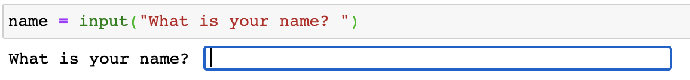
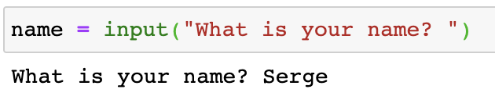
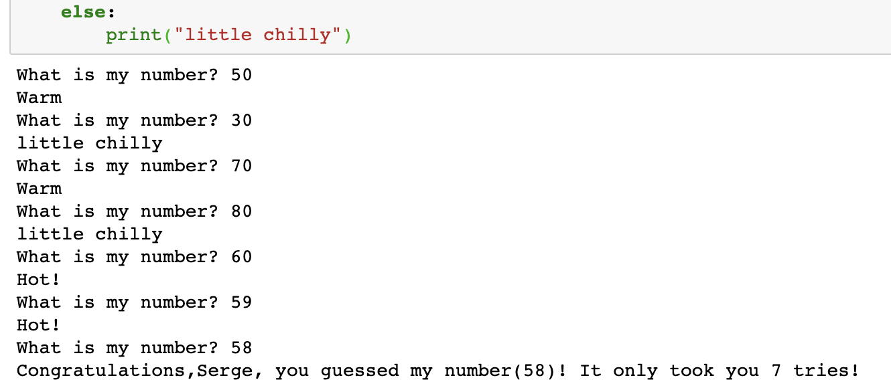
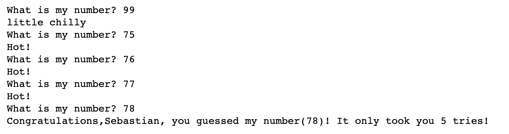

# game_guess_number

A fun and simple game. In as few attempts as possible, try and guess the number that computer selected.

At first, the game will ask the player for name.

Just go ahead and input the name to be addressed by :)

Next, the game will ask to guess the number

The game will give out hints to help player get the right number between 1 and 100.

After the number was guessed there will be a congratulating message, revealing the right number as well as the number of attempts it took the player to guess the right number!

Have fun! 
